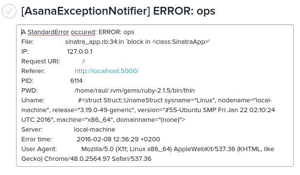
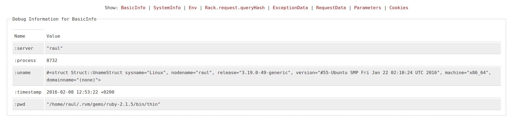

asana_exception_notifier
========================

[](http://badge.fury.io/rb/asana_exception_notifier) [](https://github.com/bogdanRada/asana_exception_notifier) [](https://github.com/bogdanRada/asana_exception_notifier)

Description
-----------

Simple ruby implementation to send notifications to Asana when a exception happens in Rails or Rack-based apps by creating a task and uploading exception details to the task

The gem provides a notifier for sending notifications to Asana when errors occur in a Rack/Rails application [courtesy of exception_notification gem](https://github.com/smartinez87/exception_notification). Check out that gem for more details on setting up the rack middleware with additional options.

IMPORTANT!!!
------------

Starting with version 0.3.1, this gem no longer uses eventmachine and em-http-request gems. Instead they are replaced with Asana gem and Typhoeus.

Requirements
------------

-	Ruby 2.0 or greater
-	Rails 4.0 or greater, Sinatra or another Rack-based application.

Dependencies
------------

1.	[ActiveSuport > 4.0](https://rubygems.org/gems/activesupport)
2.	[typhoeus >= 1.0.2](https://github.com/igrigorik/em-http-request)
3.	[asana >= 0.5.0](https://github.com/eventmachine/eventmachine)
4.	[exception_notification >= 4.1.4](https://github.com/smartinez87/exception_notification)
5.	[multipart_body >= 0.2.1](https://github.com/cloudmailin/multipart_body)
6.	[tilt >= 1.4](https://github.com/rtomayko/tilt/)
7.	[rack >= 1.6](http://rack.github.io/)
8.	[rubyzip >= 1.0.0](https://github.com/rubyzip/rubyzip)
9.	[zip-zip >= 0.3](https://github.com/orien/zip-zip)
10.	[sys-uname >= 1.0.2](https://github.com/djberg96/sys-uname)

Installation Instructions
-------------------------

Add the following to your Gemfile :

```ruby
  gem "asana_exception_notifier"
```

### Rails

If you are settting up for the first time this gem, just run the following command from the terminal:

```
rails g asana_exception_notifier:install
```

This command generates an initialize file (`config/initializers/asana_exception_notifier.rb`) where you can customize your configurations. ( Please see section **[2.2) Options for the Rack middleware](#available-options-for-the-rack-middleware)**\) for more information on available options )

Make sure the gem is not listed solely under the `production` group, since this initializer will be loaded regardless of environment.

AsanaExceptionNotifier is used as a rack middleware, or in the environment you want it to run. In most cases you would want AsanaExceptionNotifier to run on production. Thus, you can make it work by putting the following lines in your `config/environments/production.rb`:

```ruby
Rails.application.config.middleware.use ExceptionNotification::Rack
```

### Rack/Sinatra

In order to use ExceptionNotification with Sinatra, please take a look in the [example application](https://github.com/bogdanRada/asana_exception_notifier/tree/master/examples/sinatra).

Background Notifications
------------------------

If you want to send notifications from a background process like DelayedJob, you should use the `notify_exception` method like this:

```ruby
begin
  some code...
rescue => exception
  ExceptionNotifier.notify_exception(exception, notifiers: :asana)
end
```

You can include information about the background process that created the error by including a data parameter:

```ruby
begin
  some code...
rescue => exception
  ExceptionNotifier.notify_exception(exception,
    :data => {:worker => worker.to_s, :queue => queue, :payload => payload}, notifiers: :asana)
end
```

### Manually notify of exception

If your controller action manually handles an error, the notifier will never be run. To manually notify of an error you can do something like the following:

```ruby
rescue_from Exception, :with => :server_error

def server_error(exception)
  # Whatever code that handles the exception

  ExceptionNotifier.notify_exception(exception,
    :env => request.env, :data => {:message => "was doing something wrong"}, notifiers: :asana)
end
```

Available Options for the Rack Middleware
-----------------------------------------

##### asana_api_key

*String, required*

Your Personal Access Token from Asana. You can get it from [here](https://app.asana.com/-/account_api). Please make sure you keep the token secret, and don't commit it in your repository. I suggest to put it into an environment variable and use it from that variable.

##### workspace

*Integer, required*

The workspace ID where the task will be created.

**If you don't supply the workspace or the asana_api_key flags , the notifier will not run!!!**

##### assignee

*String, optional*

Who will be assigned by default to the task that is going to be created. (Default: 'me'). Can be disabled by setting it to NIL value

##### assignee_status

*String, optional*

Scheduling status of this task for the user it is assigned to. This field can only be set if the assignee is non-null. (Default: 'today'). Can be disabled by setting it to NIL value.

##### due_at

*Time, optional*

Date and time on which this task is due, or null if the task has no due time. This takes a UTC timestamp and should not be used together with due_on. Default ( Time.now.iso8601)

##### due_on

*Time, optional*

Date on which this task is due, or null if the task has no due date. This takes a date with YYYY-MM-DD format and should not be used together with due_at

##### hearted

*Boolean, optional*

True if the task is hearted by the authorized user, false if not (Default: false).

##### hearts

*Array, optional*

Array of users who will heart the task after creation. (Default: []).

##### projects

*Array, optional*

Array of projects this task is associated with. At task creation time, this array can be used to add the task to many projects at once.(Default: []).

##### followers

*Array, optional*

Array of users following this task. (Default: []).

##### memberships

*Array, optional*

Array of projects this task is associated with and the section it is in. At task creation time, this array can be used to add the task to specific sections.Note that over time, more types of memberships may be added to this property.(Default: []).

##### tags

*Array, optional*

Array of tags associated with this task. This property may be specified on creation using just an array of existing tag IDs. (Default: false).

##### name

*String, optional*

Name of the task. This is generally a short sentence fragment that fits on a line in the UI for maximum readability. However, it can be longer. (Default: "[AsanaExceptionNotifier] %Exception Class Name%").

##### notes

*String, optional*

More detailed, free-form textual information associated with the task. (Default: '')

##### template_path

*Array, optional*

This can be used to override the default template when rendering the exception details with customized template.

##### unsafe_options

*Array, optional*

This can be used to specify options as strings that will be filtered from session and from request parameters ( The options will not be displayed in the HTML template)

Screenshots
-----------





Testing
-------

To test, do the following:

1.	cd to the gem root.
2.	bundle install
3.	bundle exec rake

Contributions
-------------

Please log all feedback/issues via [Github Issues](http://github.com/bogdanRada/asana_exception_notifier/issues). Thanks.

Contributing to asana_exception_notifier
----------------------------------------

-	Check out the latest master to make sure the feature hasn't been implemented or the bug hasn't been fixed yet.
-	Check out the issue tracker to make sure someone already hasn't requested it and/or contributed it.
-	Fork the project.
-	Start a feature/bugfix branch.
-	Commit and push until you are happy with your contribution.
-	Make sure to add tests for it. This is important so I don't break it in a future version unintentionally.
-	Please try not to mess with the Rakefile, version, or history. If you want to have your own version, or is otherwise necessary, that is fine, but please isolate to its own commit so I can cherry-pick around it.
-	You can read more details about contributing in the [Contributing](https://github.com/bogdanRada/asana_exception_notifier/blob/master/CONTRIBUTING.md) document

== Copyright

Copyright (c) 2016 bogdanRada. See LICENSE.txt for further details.
